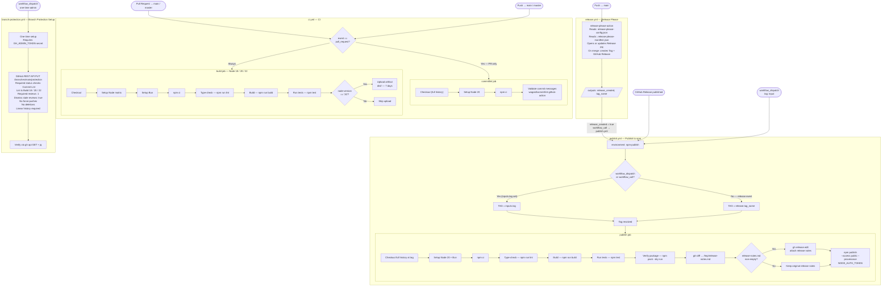

```mermaid
flowchart TD
    %% ─── EVENT SOURCES ───
    E_PR(["Pull Request → main / master"])
    E_PUSH(["Push → main / master"])
    E_PUSH_MAIN(["Push → main"])
    E_REL_PUB(["GitHub Release published"])
    E_WD_PUB(["workflow_dispatch\ntag: input"])
    E_WD_BP(["workflow_dispatch\none-time admin"])

    %% ════════════════════════════════════
    %% CI WORKFLOW
    %% ════════════════════════════════════
    subgraph CI_WF ["ci.yml — CI"]
        direction TB
        CI_PR_COND{"event ==\npull_request?"}

        subgraph CL ["commitlint job"]
            CL1["Checkout (full history)"]
            CL2["Setup Node 20"]
            CL3["npm ci"]
            CL4["Validate commit messages\nwagoid/commitlint-github-action"]
            CL1 --> CL2 --> CL3 --> CL4
        end

        subgraph BLD ["build job — Node 18 / 20 / 22"]
            B1["Checkout"]
            B2["Setup Node matrix"]
            B3["Setup Bun"]
            B4["npm ci"]
            B5["Type-check — npm run lint"]
            B6["Build — npm run build"]
            B7["Run tests — npm test"]
            B8{"node-version\n== '20'?"}
            B9["Upload artifact\ndist/ — 7 days"]
            B10["Skip upload"]
            B1 --> B2 --> B3 --> B4 --> B5 --> B6 --> B7 --> B8
            B8 -- "Yes" --> B9
            B8 -- "No"  --> B10
        end

        CI_PR_COND -- "Yes — PR only" --> CL
        CI_PR_COND -- "Always" --> BLD
    end

    E_PR   --> CI_PR_COND
    E_PUSH --> CI_PR_COND

    %% ════════════════════════════════════
    %% RELEASE WORKFLOW
    %% ════════════════════════════════════
    subgraph REL_WF ["release.yml — Release Please"]
        direction TB
        RP["release-please-action\nReads: release-please-config.json\nReads: .release-please-manifest.json\nOpens or updates Release PR\nOn merge: creates Tag + GitHub Release"]
        RP_OUT[/"outputs: release_created, tag_name"/]
        RP --> RP_OUT
    end

    E_PUSH_MAIN --> RP
    RP_OUT -- "release_created = true\nworkflow_call → publish.yml" --> PUB_ENV

    %% ════════════════════════════════════
    %% PUBLISH WORKFLOW
    %% ════════════════════════════════════
    subgraph PUB_WF ["publish.yml — Publish to npm"]
        direction TB
        PUB_ENV["environment: npm-publish"]
        TAG_COND{"workflow_dispatch\nor workflow_call?"}
        T1["TAG = inputs.tag"]
        T2["TAG = release.tag_name"]
        TAG_MERGED["Tag resolved"]

        subgraph PUB_JOB ["publish job"]
            P1["Checkout full history at tag"]
            P2["Setup Node 20 + Bun"]
            P3["npm ci"]
            P4["Type-check — npm run lint"]
            P5["Build — npm run build"]
            P6["Run tests — npm test"]
            P7["Verify package — npm pack --dry-run"]
            P8["git-cliff → /tmp/release-notes.md"]
            P9{"release-notes.md\nnon-empty?"}
            P10["gh release edit\nattach release notes"]
            P11["Keep original release notes"]
            P12["npm publish\n--access public --provenance\nNODE_AUTH_TOKEN"]
            P1 --> P2 --> P3 --> P4 --> P5 --> P6 --> P7 --> P8 --> P9
            P9 -- "Yes" --> P10 --> P12
            P9 -- "No"  --> P11 --> P12
        end

        PUB_ENV --> TAG_COND
        TAG_COND -- "Yes (inputs.tag set)" --> T1 --> TAG_MERGED
        TAG_COND -- "No — release event" --> T2 --> TAG_MERGED
        TAG_MERGED --> PUB_JOB
    end

    E_REL_PUB --> PUB_ENV
    E_WD_PUB  --> PUB_ENV

    %% NOTE: The primary path is release.yml → workflow_call → publish.yml.
    %% The release:published trigger is kept as a fallback for manual GitHub
    %% Releases or if a PAT is used later.  GITHUB_TOKEN events created by
    %% release-please do NOT trigger it (GitHub limitation).

    %% ════════════════════════════════════
    %% BRANCH PROTECTION WORKFLOW
    %% ════════════════════════════════════
    subgraph BP_WF ["branch-protection.yml — Branch Protection Setup"]
        direction TB
        BP_NOTE["One-time setup\nRequires GH_ADMIN_TOKEN secret"]
        BP_API["GitHub REST API PUT /branches/main/protection\nRequired status checks:\n  Commit Lint\n  Lint & Build 18 / 20 / 22\nRequired reviews: 1\nDismiss stale reviews: true\nNo force-pushes\nNo deletions\nLinear history required"]
        BP_VER["Verify via gh api GET + jq"]
        BP_NOTE --> BP_API --> BP_VER
    end

    E_WD_BP --> BP_NOTE
```